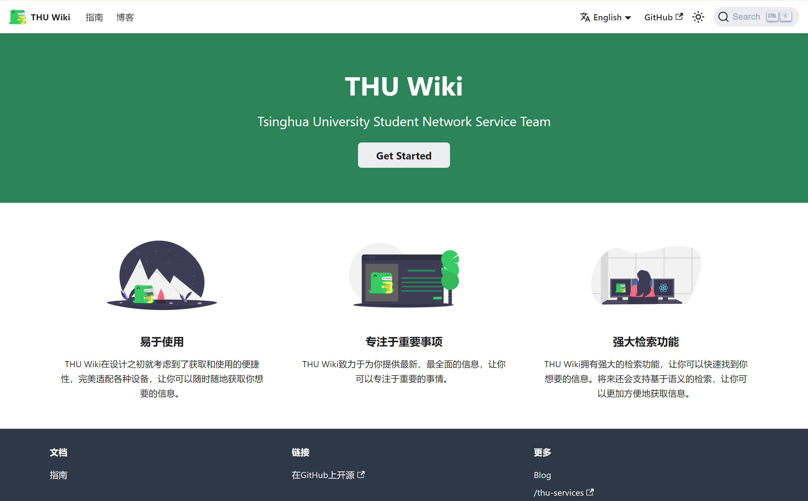

# THU Wiki Project

Welcome, this is the source code repo of the [THU Wiki](https://thu.wiki).

We are the tech group members from the Students Network Service Team of Tsinghua University, aiming to build a useful and easy-to-use wiki for the students and teachers of Tsinghua University. We are also trying to make it a platform for students to share their knowledge and experience.

## Deploy Your Own

This project is based on [Docusaurus 2](https://v2.docusaurus.io/), a modern static website generator. You can use the repo to try out and contribute to the wiki.

### Deploy on Vercel

Vercel is the easiest way to deploy the THU Wiki.
Our deployment is also running on Vercel. You can deploy your own THU Wiki with Vercel by clicking the button below.

[](https://vercel.com/new/clone?repository-url=https://github.com/thusns/thu-wiki)

_Live Example: <https://thu.wiki>_


### Deploy locally

- Install latest version of [Node.js](https://nodejs.org/en/download/)
- Clone this repo

```shell
git clone https:///github.com/thusns/thu-wiki.git
```

- Install dependencies

```shell
npm install
npm run build
````

- Open browser and visit <http://localhost:3000>

## Contributing

Since the wiki is still under construction, we are looking forward to your contribution. If you are interested in this project, please make a pull request or contact us via email: [open-source@thu.wiki](mailto:open-source@thu.wiki).
