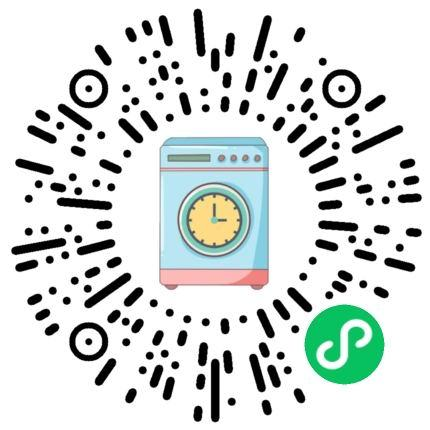

# いくつかのスクリプトとツール

## キャンパスネットワーク認証ツールの概要

車輪を作るのではなく車輪を使うという精神で、清華の人々は何世代にもわたってキャンパス ネットワークと知恵と勇気を競い合い、数え切れないほどの認証ツールを開発してきました。誰もが自分の好みに応じて選択できるように、できる限りここにリストします。

|プロジェクトリンク |サポートされているプラ​​ットフォーム |実装言語 |現在利用可能 (メンテナンス済み) |特長 |
| --- | --- | --- | --- | --- |
| [Tunet-2018 (official)](https://its.tsinghua.edu.cn/xywl/xywsyzn/yxw_hkhd_/khdxz.htm) | Windows-GUI、Linux-CLI |不明 |利用可能 |未調査 |
| [GoAuthing](https://github.com/z4yx/GoAuthing/) | Linux-CLI (x86\_64、arm、mips、ppc、riscv)、Windows-CLI、Mac OS-CLI (Intel、Apple) |行く |利用可能 |完全なプラットフォームと完全なアーキテクチャ、アクセスとアクセス、v4 と v6、systemd サービス、TUNA 認証されていない場合に認証ツールをダウンロードするための [镜像](https://mirrors.tuna.tsinghua.edu.cn/github-release/z4yx/GoAuthing/LatestRelease/) を提供し、認証関連のライブラリを提供します。
| [tunet-python](https://github.com/yuantailing/tunet-python) | Python、CLIをサポートするプラットフォーム |パイソン |利用可能 | v4 と v6、入場と終了、トラフィックと入場ステータスのモニタリング |
| [tunet-c](https://github.com/robertying/tunet-c) | OpenWRT、Linux、macOS。 CLI | C |利用可能 |認証関連のライブラリを提供します。バイナリ ファイルは小さい |
| [tunet-rust](https://github.com/Berrysoft/tunet-rust) | Windows、Mac OS、Linux、Android、iOS |錆び、ダーツ | 写真利用可能 |トラフィックとバランスのモニタリング、入場と退出、v4 と v6。認証関連のライブラリを提供します。デスクトップ上で CLI、CUI、GUI、Windows サービス、systemd サービス、launchd サービスを提供します。モバイル端末上にGUIを提供 |
| [TsinghuaTunet](https://github.com/WhymustIhaveaname/TsinghuaTunet) | Python、CLI をサポートするプラットフォーム |パイソン |特定のサブネットで利用可能 |未調査 |
| [auth-tsinghua](https://github.com/jiegec/auth-tsinghua) | Node.js プラットフォーム、CLI でサポート | JavaScript |メンテナンスされなくなりました | 「GoAuthing | 」にリダイレクトされました。
| [TsinghuaNet](https://github.com/Berrysoft/TsinghuaNet) | Windows、Mac OS、Linux、UWP、Android、iOS | C# |メンテナンスされなくなりました | 「tunet-rust」にリダイレクトされました。
| [tunet-cli](https://github.com/syimyuzya/tunet-cli) | Python、CLIをサポートするプラットフォーム |パイソン |もうメンテナンスされていません。最後のコミットは 2017 年です |未調査 |
| [Tsinghua-Online](https://github.com/xxr3376/Tsinghua-Online) |ブラウザ プラグイン、[Chrome 商店](https://chrome.google.com/webstore/detail/tsinghua-online/elkbekfdkihpbcbacmppemegcekohkjo) | JavaScript |もうメンテナンスされていません。最後のコミットは 2013 年です |ブラウザプラグイン |
| [THUNetwork](https://github.com/zhaofeng-shu33/THUNetwork) | Python プラットフォーム、CLI をサポート |パイソン |メンテナンスされなくなりました |パスワードはクリア テキストでコマンド ラインに渡されますが、これは比較的安全ではありません。

## INFO/オンラインスクールアプリ/プラグイン

車輪を作るのではなく車輪を使うという精神で、何世代にもわたる清華の人々は、INFO やオンライン スクールで知恵と勇気を競い合い、使いやすいツールを無数に開発してきました。誰もが自分の好みに合わせて選択できるよう、ここにリストするよう最善を尽くしています。

|プロジェクトリンク |サポートされているプラ​​ットフォーム |実装言語 |現在利用可能 (メンテナンス済み) |特長 |
| --- | --- | --- | --- | --- |
| [INFO](http://info.tsinghua.edu.cn/) |ウェブページ |未調査 |利用可能 |公式ウェブページ |
| [LEARN](http://learn.tsinghua.edu.cn/) |ウェブページ |未調査 |利用可能 |公式ウェブページ |
| [Learn-Project](https://github.com/xxr3376/Learn-Project) |ブラウザプラグイン |タイプスクリプト |利用可能 | Google、Firefox、Edge プラグイン ストア、最新のフロントエンドで、タイムラインとカテゴリ別に整理されたオンライン学校プロジェクト |
| [LearnX](https://github.com/robertying/learnX) | iOS、iPad OS、macOS、Android |反応する |利用可能 |プロジェクトのオープンソース ライセンス。残りについてはプロジェクトの紹介を参照してください。
| [THUInfo](https://github.com/UNIDY2002/THUInfo) |モバイルアプリ |タイプスクリプト |利用可能 | Apple App Store の配布により、家庭、学生部門 (教室)、図書館プロジェクトなど、ツリー ホールをサポートします。
|清華にて |モバイルアプリ |不明 |不明 | Apple App Storeで配布されており、残りは未調査、研究室のキャンパス祝賀会用の作品です |
| [learn2018-autodown](https://github.com/Trinkle23897/learn2018-autodown) | Pythonをサポートするプラットフォーム |パイソン |利用可能 |正確な完全な情報/ファイルのダウンロード (その他の詳細については、プロジェクトの紹介を参照してください) |
| [THUCourseHelper](https://github.com/Starrah/THUCourseHelper) |アンドロイド |コトリン |不明 |コーススケジュール |
| [thu-learn-downloader](https://github.com/liblaf/thu-learn-downloader) | Linux、Mac、Windows |パイソン |利用可能 |美しいインターフェイスを備えたオンライン教室のコース ファイルと宿題のダウンロード (詳細についてはプロジェクトのドキュメントを参照) |

## コース選択競合フラグ

授業を受けようと急いでいるのに、期待を膨らませてコース選択を提出したのに、時間が合わずにコース選択を見逃してしまっていませんか？
選択したコース時間を思い出したり、コースのスタートリストを確認したりしても遅いと感じませんか?
このスクリプトが役に立ちます!

このスクリプトは、選択したコースを検出し、候補コースのうちタイムが矛盾するコースを自動的に赤色でマークし、閲覧できるようにします。
何百万ものコースのスピードは奇跡のようです。赤くマークされた時間の上にマウスを置くと、その時間と競合するすべてのコースが表示されます。

半学期のクラスはまだ完全にはサポートされていないため、誤った時間の競合が発生する可能性があることに注意してください。
同時に、開講情報やコース選択の問い合わせインターフェースは動作せず、コース選択操作インターフェースのみ動作します。

このスクリプトは aux/TsinghuaCourseConflictMarker.user.js にあり、Oil Monkey を使用してインストールする必要があります。

または、[这里](https://greasyfork.org/en/scripts/408340-tsinghuacourseconflictmarker) にアクセスしてアクセスできます。
ワンクリックでスクリプトを入手してください。

Webvpn のサポートが追加されました。

技術的な指導をしていただいた [CircuitCoder](https://github.com/CircuitCoder) に感謝します
提案とデバッグをしてくれた [SharzyL](https://github.com/SharzyL) に感謝します

## コース選択用の残りのコース内容マーク

授業を受けるためにどのようなボランティアを利用すればよいかわかりませんか?
このスクリプトが役に立ちます!

このスクリプトは応募者の数を色付けします。最後の緑色はクラスを獲得するのに最適な候補です。

スクリプトはまだ開発中であり、キューのサポートは間もなく提供される予定です。

[这里](https://greasyfork.org/en/scripts/456440-colorful-course) にアクセスしてスクリプトを入手してください

## INFO オンラインスクール電報メッセージプッシュ

[thu-weblearn-tgbot](https://github.com/Konano/thu-weblearn-tgbot) および
[thu-info-forwarder](https://github.com/Konano/thu-info-forwarder)。

THU INFO CHANNEL は Telegram にすでに存在します。プライベート チャネルであるため、[邮件](mailto:i@zenithal.me) を渡す必要があります
招待リンクを取得します。

## 全校の洗濯機の状況

### 全校の洗濯機状況 - 洗濯機照会ツール（インターフェース付き）

https://washer.sdevs.top/

インターフェイスはシンプルで使いやすく、データは整理されており、クエリされたアパートの建物を記憶でき、フィードバック チャネルが提供されます。

### 清華大学ランドリールームの空き状況の問い合わせ

https://washer.voltair.top/

### 全校の洗濯機の状況 - 公式アプレット

洗濯機メーカーのアプレットでも洗濯機の状態を確認できます。

入り口はホームページ下部の「近くの洗濯機」ボタンです。


### 全校の洗濯機ステータス - API インターフェース (テキスト版、廃止)

まだ洗濯機を手に入れるために頑張っていますか？あなたはまだ洗濯機がないことに気づき、上ったり下ったりして苦しんでいませんか？このサービスは
家にいながらにして洗濯機の状態を検知し、ワンクリックで学校全体の洗濯機の傾向を知ることができます。

ソース コードはリポジトリの aux ディレクトリにあります。現在、[https://washer.thu.services](https://washer.thu.services) の cf ワーカーにデプロイされています

検索を実装するには、パラメータを追加する必要があります。現在、「s」、「j」、「p」の 3 つのパラメータを受け入れます。 「s」は検索です
集合住宅の場合、一般に受け入れられる文字列は「Building x, Bauhinia」または「Building x, South District」です。例えば

```
https://washer.thu.services/?s=紫荆1号楼
```

「紫京第一ビル」の洗濯機の稼働状況を返します。デフォルトでは、このパラメータは次の値を返します。
「紫京2号館」の洗濯機の稼働状況。

「j」パラメータについては、「j」が存在するかどうかのみをチェックします。存在する場合は、元の json データが返されます。
この項目は開発者向けです。 「s」パラメータと「j」パラメータは同時に使用できます。

「p」パラメータについては、「p」が存在するかどうかのみをチェックします。存在する場合は、テキスト/プレーン データが返されます。
「s」パラメータと「p」パラメータは同時に使用できます。 「j」と「p」が同時に出現した場合は「j」が優先されます。

### 全校の洗濯機ステータス - iOS ショートカット (利用不可)

iOS 12 以降のユーザーは、この [链接](https://www.icloud.com/shortcuts/ffc9d9fff7e140ec9e5a92e5f7d16ae0) を通じてショートカットをインストールし、アイドル状態の洗濯機をすぐに確認できます。現在、フロアに対して正確なクエリのみがサポートされています。

### 全校の洗濯機のステータス - Telegram Bot Erha (利用不可)

このインターフェイス [Konano](https://github.com/Konano) に基づいて、Erha という名前のテレグラム ボットが開発されました。

プロジェクトのアドレスは [此](https://github.com/Konano/Tuna-Erha-Bot) です。洗濯機の状態照会機能以外にも様々な機能があります。

ボットには [t.me/erhabot](https://t.me/erhabot) 経由でアクセスできます。

### 洗濯物の監視とリマインダー - WeChat アプレット (利用不可)



同じ API を使用して、洗濯機に注意を払った後、洗濯機がアイドル状態になると、WeChat サービス アカウントを通じてリマインダーが送信されます。

[项目地址](https://github.com/zrt/thu-wash-notify)

## 情報 GPA 計算ツール

cksqs が失敗した後、ワンクリックで GPA をクエリするのは難しいですか、それとも GPA を取得するには 10 元を費やす必要がありますか?
この種の GPA は有効数字 3 桁のみを保持し、[-0.005,0.005); の四捨五入により人々に大きな不確実性を感じさせます。
GPAを手計算する学生にとって、学年が上がり、科目数が増えるにつれて、手計算の難易度はますます高くなります。
GPAの計算は一度だけで済むので非常に面倒です。

そこで、GPA自動計算機能を提案しました。従来通り、利便性や使いやすさなど様々な要素を考慮し、
この小さな機能を実装するためにユーザースクリプトが導入されました。

このスクリプトは、「INFO-All Results」インターフェイスに存在する結果のみを読み取ります（システムに入力されたものの公開されていない結果は、
cksqs または有料成績証明書を通じて取得され、計算には含まれません）、新旧のアルゴリズムを使用してすべての GPA と必要な GPA を組み合わせます
それを計算し (double を直接出力)、通知リマインダーをポップアップ表示します。

このスクリプトは `aux/Tsinghua GPA Calculator.user.js` にあり、Oil Monkey を使用してインストールする必要があります。

または [这里](https://greasyfork.org/zh-CN/scripts/410960-tsinghua-gpa-calculator) 経由
入手する。

## 清華大学 GPA クエリ

導入については前のセクションを参照してください。

「INFO-全成績」ページで各学期のGPAと必修・必修成績の合計を計算します。スクリプトのアドレスは [此](https://greasyfork.org/zh-CN/scripts/420540-清华大学gpa查询) です

## 雨の教室ヘルパー

このユーザー スクリプトは、大画面デバイス (PC、タブレット) 上の Rain Classroom の生徒により良いユーザー エクスペリエンスを提供するように設計されています。

プロジェクトのアドレスは [此](https://github.com/RainEggplant/rain-classroom-helper) です

## 清華大学統合プラットフォームビデオ自動再生

スクリプトは [此](https://github.com/Co1lin/Tsinghua-Yukuotang-Autoplay) にあり、[tsinghua.yuketang.cn](https://github.com/Co1lin/Tsinghua-Yukuotang-Autoplay/blob/main/tsinghua.yuketang.cn) でコースビデオを自動的に再生できます。

## Xuetang オンラインビデオが自動的に再生されます

MOOCsをバックグラウンドで学習しているときに、停止していないかよく確認しますか?スクリプトによって次のレッスンが自動的に再生されます。

スクリプトは [此](https://greasyfork.org/en/scripts/373881-清华学堂在线视频自动播放) にあります

このスクリプトには長い歴史があり、長期間メンテナンスされておらず、いくつかのバグも含まれているため、長期的な可用性は保証されません。問題を発見したり、コードを改善したりした場合は、原作者 @RikaSugiwa に連絡してください。

## Xuetang オンライン字幕ダウンローダー

復習の準備をするときに、まだビデオを 1 つずつめくって字幕をダウンロードしていますか?このスクリプトが役に立ちます!

Rabbit Hu バージョン: スクリプトは [此](https://greasyfork.org/zh-CN/scripts/408878-xuetangx-caption-crawler) にあり、プロジェクト アドレスは [此](https://github.com/Rabbit-Hu/xuetangx-caption-crawler) にあります。

Roberts Holder バージョン: プロジェクトのアドレスは [此](https://github.com/rcy17/MOOC_subtitle_spider) です

前川リンコ版: プロジェクトのアドレスは [此](https://github.com/lynzrand/xuetangx_sub) です

c7w バージョン: プロジェクトのアドレスは [此](https://github.com/c7w/TsinghuaMoocCaptionCrawler) です

## Rain Classroom コースウェア ダウンローダー

現在は「長江の雨の教室」のみに適用されていますが、改修後は蓮池の雨の教室でも使用できるようになります。

プロジェクトのアドレスは [此](https://github.com/ShevonKuan/yuektang_ppt2pdf) です。

## 清華教の参考書クロール

学校図書館は大量の [图书资源](https://nav.lib.tsinghua.edu.cn/cgi-bin/searchuse.cgi?c=7) を購入しました。中国語教材を探すには、まず [清华大学教参服务平台](http://reserves.lib.tsinghua.edu.cn/) と [文泉学堂-清华大学出版社电子图书数据库](https://lib-tsinghua.wqxuetang.com/) を使用することをお勧めします。

### 清華大学教授リファレンス サービス プラットフォーム

清華大学教材サービス プラットフォームは、著作権の範囲内でコース教科書および教材のスキャンされた電子版を提供します（オンライン閲覧）。プラットフォームで入手できない教材が必要な場合は、スキャンのために電子メールまたは電話で [相关部门](https://lib.tsinghua.edu.cn/info/1184/3617.htm) に直接連絡できます。

ダウンロードには [reserves-lib-tsinghua-downloader](https://github.com/libthu/reserves-lib-tsinghua-downloader) を使用することをお勧めします。

ダウンロード機能は[thu-info-lib](https://github.com/thu-info-community/thu-info-lib)にも実装されています。

API変更により、以下の2点が利用できなくなりました。

原文より引用： 最近の疫病は深刻で、教科書の購入が困難になっています。みんなのオンライン学習を促進するために、清華大学の教材をクロールするための Python スクリプトを書きました。

プロジェクトのアドレスは [此](https://github.com/lflame/TsinghuaBookCrawler) です

元のテキストを引用する:本の各ページの元の画像を自動的にダウンロードします。

プロジェクトのアドレスは [此](https://github.com/i207M/reserves-lib-tsinghua-downloader) です

### 文泉学院

Wenquan Xuetang は、清華大学出版局の書籍を検索するために使用されます。アンチクローリングは厳格です。 [这个](https://greasyfork.org/zh-CN/scripts/437737-%E6%96%87%E6%B3%89%E5%AD%A6%E5%A0%82pdf%E4%B8%8B%E8%BD%BD%E4%BF%AE%E5%A4%8D%E7%89%88) スクリプトを使用してダウンロードできます。

## コースの場所の共有

現在利用可能: [courseX 课程信息共享计划](https://tsinghua.app/courses) は learnX 開発チームによって維持されています

以下のプロジェクトは現在メンテナンスと運用を停止しています。

[https://wmcgcdn.rika.tech/](https://wmcgcdn.rika.tech/) では、プロジェクト アドレスは [此](https://github.com/RikaKagurasaka/where-my-course-gone-backend) です。

## 登録マーク（乗車券用）

キャンパス外から関連する登録マークを簡単に取得するには、[此网站](https://tuixue.online/zcimage/) を参照してください。

## 寮の電気代照会

ヘッドレス Chrome 経由で [实现](https://github.com/WhymustIhaveaname/TsinghuaElectric) があります

別の実装もあります。aux ディレクトリの `TsinghuaElectricityBillChecker.py` を参照してください。ユーザーはいくつかの埋め込みパラメータを変更する必要があります。

別の実装もあります。aux ディレクトリの `TsinghuaBills.py` を参照してください。

これらのスクリプトを通じて、データを grafana に流し込み、電気料金の監視と警報を実現できます。

## 寝室の水道・電気代の問い合わせ

aux ディレクトリの `TsinghuaBills.py` を参照してください。

注: このスクリプトは寮の水道料金残高 (キャンパス カード ウォレットではありません!) をクエリでき、主に W Building と Shuangqing Apartment に適用されます。具体的な適用範囲：双清アパート、バウヒニア学生アパート14号棟、バウヒニア学生アパート15号棟、バウヒニア学生アパート16号棟、バウヒニア学生アパート17号棟、17号棟、18号棟。

このスクリプトは、grafana にデータを注ぎ込んで、公共料金の監視と警報を実装できます。

## 清華大学の授業着信音

家では勉強する雰囲気がなく、学校の自習室が恋しいですか？清華着信音ソフトウェアが役立ちます!

現在、macOS バージョンのプロジェクト [在此](https://github.com/LyricZhao/THU-Bell) があります。

## キャンパス内のレストランをランダムに選択 - WeChat ミニ プログラム

食堂が多すぎてどこで食べればいいのか分からない？乱数ジェネレーターが役立ちます!

[此](https://github.com/SuXY15/RandomCanteen) のプロジェクト

ミニプログラムQRコード


## キャンパス内のレストランをランダムに選択 - Telegram Bot

同上。

さらに、Telegram Botは、オンラインでミルクティーを飲む、オンラインでカプチーノを飲む、ドリンクをオンラインで製造するなどのインタラクティブな機能も提供します。

プロジェクトのアドレスは [此](https://github.com/Lancern/thufood-tgbot) です

BOT アドレスは https://t.me/thufood_bot です

同様のものは https://t.me/thufoodbot です

## 清華大学コンピュータサイエンスコースガイド

[GitHub地址](https://github.com/PKUanonym/REKCARC-TSC-UHT) および [校内地址](https://git.tsinghua.edu.cn/pkuanonym/REKCARC-TSC-UHT)

## 清華ソフトウェア工学研究所コースガイド

[GitHub地址](https://github.com/SerCharles/THSS-CRACKER)

## 華清大学コースガイド共有プラン

学校の全生徒を対象としたコースガイド共有計画は、学習リソースにおける情報の非対称性を排除し、学習リソースと教材のオープンな共有を促進することを目的としています。プロジェクト [在此](https://closed.social/pastExam/)。 GitHub と比較して、共有やダウンロードの操作は、テクノロジーに詳しくない学生にとってもフレンドリーです。共有へようこそ!


## キャンパス教育評価プラットフォーム

Colleguide: 学校、教授、コースを評価するプラットフォーム

https://www.colleguide.com/

## コンピュータサイエンス学科に関する事実

https://github.com/jiegec/dcst-facts

## NFキャンパスカードを見る

https://github.com/nfcim/nfsee

## コース情報共有プラン

https://tsinghua.app/courses

## 清華大学コンピュータ専攻 912 大学院入学試験資料

https://github.com/Wsky51/THU-CS912-kaoyan

## 清華スコアスクラッチャー

https://github.com/summivox/thu-scratch

* Chrome プラグインまたはユーザースクリプトをインストールする
* ログイン情報
* 結果を確認できる場所がブロックされました~
* 心の中で「ドキドキ」する

## トゥーホールの思い出

すべてのコンテンツはブティック ケイブと個人のコレクションから来ています。

https://github.com/pb0316/thuhole_memories

## thuholeデータベースのバックアップ

データを洗浄した後、個人のプライバシーに関係しない意味のあるツリー ホールのほとんどは、この GitHub リポジトリにバックアップされます。

https://github.com/thuhole/database_backup

## 計算学科学生科学協会スキルガイダンス文書

このスキル ガイダンス文書は、清華大学コンピューター サイエンス学生協会によって管理されています。目標は、コンピューター サイエンスとコンピューター サイエンスの学生が特定の特定のスキルを迅速に習得できるようにすることです。これらのスキルをコース、科学研究、インターンシップで活用できる方法を提供することで、学生が関連情報を収集する時間を節約し、学生が新しいスキルを学ぶ能力を向上させます。

https://docs.net9.org/

## 清華大学大学院生の社会実践システム クローラー

https://thshijian.tsinghua.edu.cn (清華大学大学院社会実践システム) からの構造化データをクロールします。ご自身の責任でご使用ください。

https://github.com/Harry-Chen/thshijian-crawler
