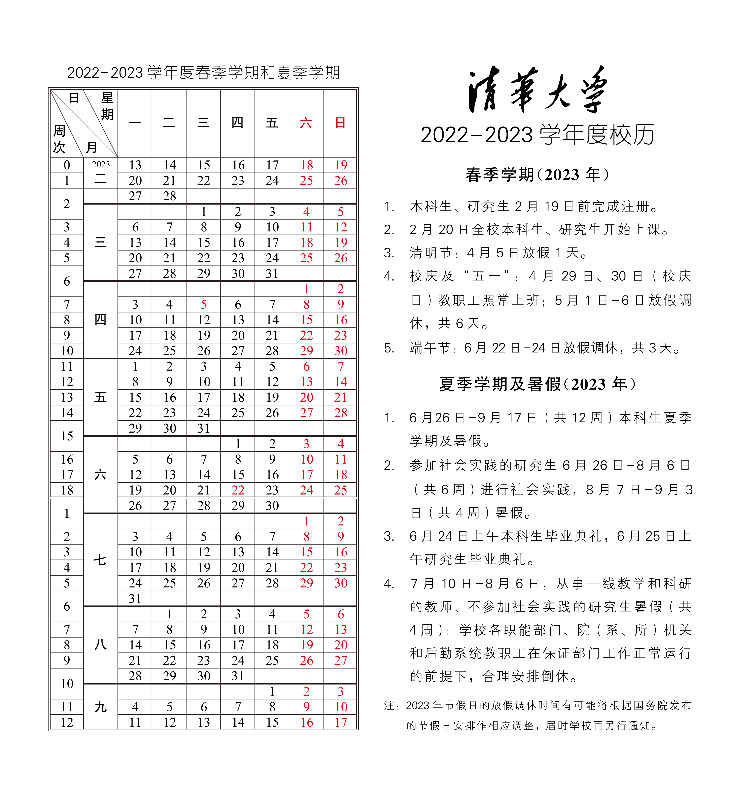
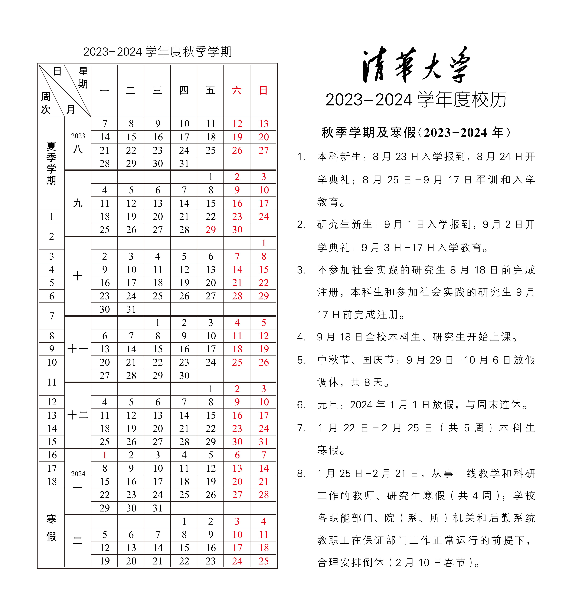
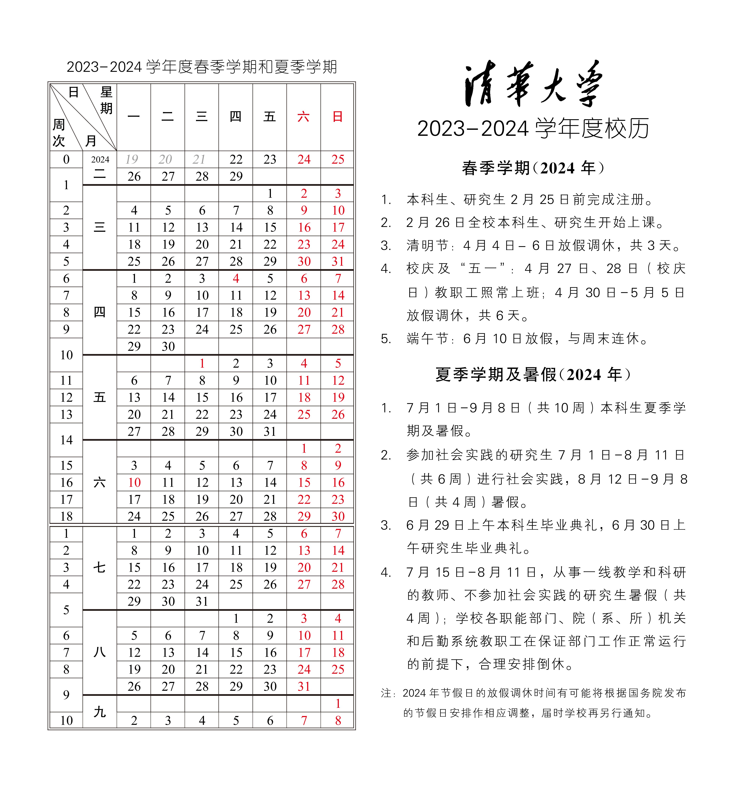

# INFO coleta de informações importantes

## Calendário escolar

Caminho de acesso rápido: INFO (VPN necessária fora do campus)->Login->Compreensivo->Calendário Acadêmico no canto superior direito

### Ano letivo 2022-2023

## Programa de formação profissional de graduação

[清华官网培养方案链接](https://www.tsinghua.edu.cn/jyjx/bksjy/bkzy.htm)

[计算机系 19 级培养方案 info 版本（需要已经登录 info）](http://zhjw.cic.tsinghua.edu.cn/jhBks.vjhBksPyfakzbBs.do?m=pyfakzFrame&fajhh=193024111&theModule=pyfa)

Pode-se notar que o 19 em 193024111 no endereço acima indica o plano de treinamento de nível 19, e o seguinte 3024111 é
Códigos relacionados ao departamento

[各级各院系培养方案（需要已经登录 info）](http://zhjw.cic.tsinghua.edu.cn/jhBks.vjhBksPyfabBs.do?theModule=pyfa)

Aqui está o índice de cada série e departamento

## Materiais promocionais escolares

### Versão INFORMATIVA

Incluindo logotipo da Universidade de Tsinghua, emblema da escola, cores da escola, músicas e letras da escola da Universidade de Tsinghua, exposição de Tsinghua, versão chinesa de Tsinghua Overview, Universidade de Tsinghua
Folheto em inglês, versão em chinês, versão em inglês do vídeo promocional da Universidade de Tsinghua e materiais relacionados às especificações do logotipo da unidade secundária da Universidade de Tsinghua.

Caminho de acesso rápido: INFO -> Home -> Meio da parte inferior da página

[学校宣传资料（校外需要 VPN）](http://info.tsinghua.edu.cn/html/xxxczl/xczlxz.htm)

### Versão inicial

Visão geral da Universidade Tsinghua, folhetos, hino escolar e vídeos promocionais.

[学校宣传资料](https://www.tsinghua.edu.cn/zjqh/syxx/xczy.htm)

## Cronograma de seleção do curso

Caminho de acesso rápido: [ACADEMIC](http://academic.tsinghua.edu.cn/) (VPN necessária fora do campus) -> Login
->Coluna de seleção de cursos à esquerda->"Cronograma de seleção de cursos" na seleção de cursos de graduação

## Atalho de seleção de curso

[选课登录（校内或 SSLVPN）（选课时间内有效）](http://zhjwxk.cic.tsinghua.edu.cn/xklogin.do)

## Instruções relacionadas ao sistema de seleção de cursos

A sua escola tem dois ou até três sistemas de seleção de cursos, nomeadamente zhjw, zhjwxk e zhjwxkyw. Os dois últimos estão dentro do prazo de seleção do curso
Ligue, o primeiro ligará normalmente.

Para o primeiro, o caminho de acesso usual é [ACADEMIC](http://academic.tsinghua.edu.cn/) (VPN é necessária fora do campus)
->Login->Coluna de seleção de cursos à esquerda->Seleção de cursos de graduação. Geralmente usado para visualizar informações de abertura do curso fora do horário de seleção do curso.

O ganhador poderá entrar pelo atalho, ou efetuar login pela interface intermediária após efetuar login em info/acadêmico, webvpn
Também aponta para este sistema de seleção de cursos 3. Este método de login só é viável se e somente durante o período de seleção do curso.

Este último é semelhante ao do meio, você só precisa alterar o URL relevante durante a operação.

## Consulta de horário/local do exame final

Costumava haver um método de filtragem no Info, mas infelizmente por alguns motivos, essa função foi excluída pelo Info. Agora o Info só possui informações de exames de todos os cursos.

Agora você precisa fazer login em [ACADEMIC](http://academic.tsinghua.edu.cn/), entrar no portal e visualizar os cursos deste semestre

## Catálogos de cursos de graduação ao longo dos anos

[历年本科生开课目录（校内或 SSLVPN）](http://announce.cic.tsinghua.edu.cn/node/25833)

## Sistema de Orientação da Universidade Tsinghua

O Sistema de Orientação da Universidade Tsinghua é um site onde os candidatos podem verificar suas informações de inscrição no local e se o processo de inscrição foi concluído.

[清华大学迎新系统](http://szyx.cic.tsinghua.edu.cn/index.jsp)

## Marca de registro (para passagens de trem estudantis)

Caminho de acesso rápido: INFO (VPN necessária fora do campus) -> Login -> Geral -> "Informações sobre status do aluno" na foto no canto superior direito -> Marcas de matrícula anteriores

Tokens de registro adicionais podem ser encontrados na seção [utils.md](utils.md).

## Ônibus escolar no campus

[校内交通介绍](https://www.tsinghua.edu.cn/zjqh/syxx/xyjt.htm)
[校车交通路线图](https://www.tsinghua.edu.cn/__local/3/BB/BE/7260A578E48A6BA827528DE4F74_004A1626_73CEC.png)

Para saber o status de operação dos ônibus escolares em tempo real, você pode utilizar o APP e/ou miniprograma mencionado em “Introdução ao Transporte Escolar”

## Mapa do campus (versão estática)

[校内地图](https://www.tsinghua.edu.cn/zjqh/xyfg/xydt.htm)

## Sistema de questionário da Universidade de Tsinghua

[清华大学调查问卷系统](https://wenjuan.tsinghua.edu.cn)

## Código Tsinghua Bauhinia

O link é [https://zijing.tsinghua.edu.cn/tp\_jp/h6?m=jp#act=jp/serviceapplication](https://zijing.tsinghua.edu.cn/tp_jp/h6?m=jp#act=jp/serviceapplication)

O método de utilização é: após abrir e fazer login pela primeira vez, abra a página novamente (ou atualize-a diretamente) e o código Bauhinia será exibido. Desta forma você não fica restrito à plataforma WeChat.

Observe que o "código de verificação de localização" não pode ser usado neste método.

Você pode usar um navegador para criar um atalho na área de trabalho. Tomando como exemplo o Chrome móvel, instale o atalho através da opção “Adicionar à tela inicial” após abrir a página web.

## eduroam

Visite https://guestman.tsinghua.edu.cn:8443/ para se registrar. Nota: Só pode ser usado fora da Universidade Tsinghua.

## consulta cksqs GPA

Nota: Atualmente, este método é basicamente inválido e só pode ser acessado quando o sistema de segundo grau estiver aberto.

Após fazer login no INFO, visite http://jxgl.cic.tsinghua.edu.cn/jxpg/f/xssq/exwfx/xssqb/cksqs para ver seu GPA.

## Plataforma de serviço abrangente de logística da Universidade de Tsinghua

https://pt.tsinghua.edu.cn/

que contém

### Números de telefone de todas as unidades do campus (incluindo o hospital do campus)
### Cadastro em diversos departamentos do hospital escolar
### Mapa do campus (versão dinâmica)
Você pode se localizar, visualizar bloqueios de estradas (para veículos motorizados) e pesquisar várias instalações no campus por categoria.
### Relatório de reparo on-line
### serviço de quarto
### Serviço de reserva de carro

## Código postal, endereço postal e selo postal

https://www.tsinghua.edu.cn/xssqglfwzx/info/1043/1174.htm

Embora esteja marcado: “Durante o processo de inscrição, caso os alunos deixem seus endereços de e-mail, o sistema notificará automaticamente os alunos por e-mail quando eles tiverem novos boletos ou pedidos de remessa”. No entanto, o autor não recebeu nenhum e-mail relevante.

## Sistema de consulta de autoatendimento do cartão do campus da Universidade de Tsinghua

http://ecard.tsinghua.edu.cn/user/Index.do

## Baixe ACM/IEEE/HowNet e outros artigos (Shibboleth ou OpenAthens)

Veja autenticação institucional em http://lib.tsinghua.edu.cn/tjfw/xwfw.htm.

## Voucher de reembolso de passagem de trem

No lado leste do Edifício Bauhinia 1, na estrada que leva a Taoli, existe uma máquina de coleta de vouchers de reembolso de passagens de trem.

## Dispositivo registrado DIVI

Depois de conectar-se ao DIVI, visite Register.your.device

## E-mail da Universidade de Tsinghua

O endereço de e-mail do aluno é abbr@mails.tsinghua.edu.cn, e você pode usar abbr@mails.thu.edu.cn para receber e-mails.

O endereço de e-mail do professor é abbr@mail.tsinghua.edu.cn, e você também pode usar abbr@tsinghua.edu.cn. Os dois são equivalentes.

Não há implementação especial de lista de discussão. Geralmente, as caixas de correio dos professores são usadas e o encaminhamento de grupo é usado para implementar a lista de discussão.

Não abbr@thu.edu.cn.

Tsinghua também tem o nome de domínio tsinghua.edu. Embora tenha sido resolvido, não foi usado (Nota: ustc.edu ao lado é usado como endereço de e-mail de ex-alunos)

### E-mail de ex-alunos da Universidade de Tsinghua

Visite https://mailservice.tsinghua.org.cn/ para ativar.

O endereço de e-mail é abbr@tsinghua.org.cn.

## Serviço no verso da Universidade de Tsinghua

Basta visitar https://overleaf.tsinghua.edu.cn/.

## LibGuides na Universidade de Tsinghua

https://tsinghua.cn.libguides.com/

## novos tempos

https://qxcm.tsjc.tsinghua.edu.cn/pc/folder120

## Número de pessoas que entram em cada cantina

> WeChat-> Serviço de Informações da Universidade de Tsinghua-> Número de pessoas que entram na cantina estudantil

Fechado
